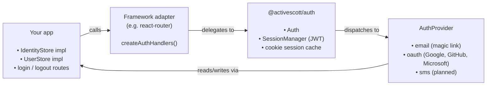

# Architecture

This document outlines the project structure and architectural decisions.

Related documents:

- [CODE_STANDARDS.md](./CODE_STANDARDS.md) - Coding standards and conventions
- [SECURITY.md](./SECURITY.md) - Security guidelines and best practices
- [CONTRIBUTING.md](./CONTRIBUTING.md) - Development workflow
- [AGENTS.md](./AGENTS.md) - Project context and goals

## Contribution Scope

This local copy of `activescott/auth` exists to extend the upstream project with OAuth providers and Hono framework support. Key additions:

- `packages/auth-provider-oauth` — OAuth 2.0 / OIDC base class + Google, GitHub, Microsoft providers
- `packages/auth-adapter-core` — shared handler logic extracted from framework adapters
- `packages/auth-adapter-hono` — Hono / Cloudflare Workers adapter

Changes to `packages/auth` core should be minimal — the `AuthProvider` interface is the extension point.

## Project Structure

```text
packages/
├── auth/                        # @activescott/auth — core library
│   └── src/
│       ├── auth.ts              # Auth class: request routing, session cache
│       ├── types.ts             # All public interfaces and types
│       ├── errors.ts            # AuthErrors factory
│       ├── config.ts            # isProviderEnabled() helper
│       ├── index.ts             # Public exports
│       └── session/
│           └── session-manager.ts  # JWT cookie creation/verification
├── auth-provider-email/         # @activescott/auth-provider-email
│   └── src/
│       ├── email-provider.ts    # EmailProvider: magic link initiate/verify
│       ├── config.ts            # EmailProviderConfig schema (zod)
│       ├── types.ts             # EmailTransport interface
│       └── transports/
│           └── nodemailer.ts    # Default SMTP transport
├── auth-provider-oauth/         # @activescott/auth-provider-oauth
│   └── src/
│       ├── base/
│       │   ├── oauth-provider.ts  # Abstract OAuthProvider: PKCE, OIDC discovery, JWKS cache
│       │   └── state-cookie.ts    # OAuth state cookie (CSRF + PKCE verifier)
│       ├── providers/
│       │   ├── google.ts          # GoogleProvider (OIDC)
│       │   ├── github.ts          # GitHubProvider (OAuth 2.0, non-OIDC)
│       │   └── microsoft.ts       # MicrosoftProvider (OIDC, multi-tenant aware)
│       └── index.ts
├── auth-adapter-core/           # @activescott/auth-adapter-core
│   └── src/
│       ├── handlers.ts          # createAuthHandlers, sendMagicLink, all types
│       └── index.ts             # Public exports
├── auth-adapter-react-router/   # @activescott/auth-adapter-react-router
│   └── src/
│       ├── handlers.ts          # Re-exports from auth-adapter-core
│       └── index.ts             # Public exports
└── auth-adapter-hono/           # @activescott/auth-adapter-hono
    └── src/
        ├── handlers.ts          # Re-exports from auth-adapter-core
        ├── middleware.ts        # requireAuthMiddleware, optionalAuthMiddleware, createAuthHandler
        └── index.ts             # Public exports
examples/
└── react-router/                # Full React Router v7 framework-mode example
    ├── app/lib/auth.server.ts   # Example IdentityStore + UserStore + Auth setup
    └── tests/                   # Playwright e2e suite (separate workspace)
docs/                            # Developer documentation
.github/workflows/ci.yaml        # CI: validate → e2e → release → publish
```

## Core Data Model

- **`AuthUser`** — minimal `{ id, metadata? }`. Apps extend this with their own fields.
- **`Identity`** — a `(provider, identifier)` pair (e.g. `"email"` / `"alice@example.com"`) linked to a user. One user can have many identities (ready for multi-provider login).
- **`Session`** — a JWT stored in an `HttpOnly` cookie. Contains `userId`, `identifier`, `provider`, `iat`, and `exp`. No server-side session store needed.

## Extension Points (Implemented by the Consuming App)

- **`IdentityStore`** — CRUD for `(provider, identifier, userId)` rows in your database.
- **`UserStore`** — CRUD for user records. `create()` is called automatically on first login.
- **`AuthProvider`** — interface for auth methods. Implement `initiate`, `verify`, `canHandle`, `getRoutes`. Adding a new provider (SMS, OAuth) requires no changes to core.
- **`EmailTransport`** — swap in any email backend (Resend, SES, etc.) in place of the default Nodemailer transport.

## Request Flow



1. App calls `auth.handleRequest(request)` (or the adapter's `handleAuth`).
2. `Auth` routes by URL pattern `/auth/{provider}/{action}`.
3. `initiate` — provider sends the magic link / starts OAuth.
4. `verify`/`callback` — provider validates the token and returns `AuthResult`.
5. The adapter creates a session cookie and redirects on success.

`Auth.verifySession(request)` verifies the JWT, checks `UserStore`/`IdentityStore` once, then caches the result in-memory for 2 minutes (cleaned up every 5 minutes) to reduce DB load.

## Technology Stack

- Runtime: Node.js v22+ / edge runtimes (Cloudflare Workers)
- Language: TypeScript (strict mode, ESM, NodeNext)
- Module resolution: NodeNext — `.js` extensions required on all imports
- Package manager: npm workspaces
- Testing: Vitest (unit), Playwright (e2e)
- Linting: ESLint 9 (flat config) + Prettier + Markdownlint
- Hooks: Husky + lint-staged
- Release: `@simple-release` (automated on CI via `scripts/release.ts`)
- Publishing: npm OIDC trusted publishing (no `NODE_AUTH_TOKEN`)

## Configuration Files

- `tsconfig.json` — root composite config with project references
- `packages/*/tsconfig.json` — per-package strict TypeScript config
- `eslint.config.mjs` — ESLint rules (flat config, covers all packages)
- `eslint.config.mjs` — ESLint rules (flat config)
- `.prettierrc.json` — Prettier rules
- `.markdownlint.json` — Markdown linting rules
- `commitlint.config.js` — conventional commit enforcement
- `.nvmrc` — Node.js version pin

## Session Cookie Details

`SessionManager` (`packages/auth/src/session/`) signs and verifies JWTs using `jsonwebtoken`. The `additionalSecrets` field in `SessionConfig` allows accepting tokens signed with older secrets — used in e2e tests to inject pre-signed sessions without going through the email flow. The `maxAge`/expiry strings use the `"30d"` / `"5m"` format (days, hours, minutes, seconds).

## Security Considerations

See [SECURITY.md](./SECURITY.md) for secret management, dependency security, and authentication practices specific to this library.
